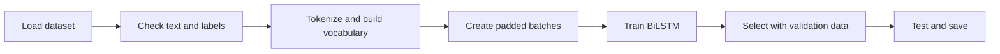
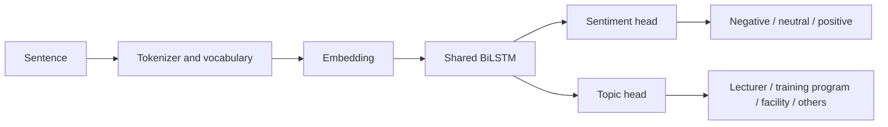

# UIT-VSFC LSTM workflow

## Goal

Classify Vietnamese student feedback with a bidirectional LSTM (BiLSTM). The dataset provides two labels per sentence: sentiment and topic. Start with one shared BiLSTM and two output heads. If only sentiment is needed, remove the topic head.

## Workflow

1. **Load data.** Use the supplied train, validation, and test splits. Keep test data aside until final evaluation.
2. **Check data.** Count each label. Check empty sentences and duplicate sentences across splits.
3. **Prepare text.** Choose one Vietnamese tokenization method. Build the vocabulary from training text only. Add padding and unknown-token IDs. Use the same method for all splits.
4. **Create batches.** Convert tokens to IDs. Pad sentences within each batch and keep their original lengths. Truncate long sentences using a limit chosen from training data.
5. **Build the model.** Use an embedding layer, a BiLSTM, and a classification head for each selected task. Exclude padding from the sentence representation.
6. **Train.** Use the training split and classification loss. If both tasks are active, combine their losses. Record the validation score after each epoch and save the best checkpoint.
7. **Evaluate.** Use validation macro F1 to select settings. Then run the saved checkpoint on the test split once. Report accuracy, macro F1, per-class results, and a confusion matrix for each task.
8. **Save for inference.** Save model weights, vocabulary, tokenization settings, sentence-length limit, and label names together. Apply the same text preparation to new sentences.

## Model relationships

The workflow diagram shows the build order. The relationship graph shows how one sentence feeds the selected output heads. Each head needs its own evaluation result.

## Current project state

`train.py` and `main.py` load the dataset. The project has PyTorch, but it does not yet contain tokenization, an LSTM, training, evaluation, or saved model files. Implement those parts in workflow order.

Dataset: [UIT Vietnamese Students' Feedback Corpus](https://huggingface.co/datasets/uitnlp/vietnamese_students_feedback).
