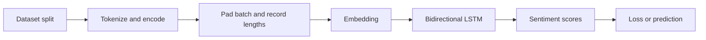
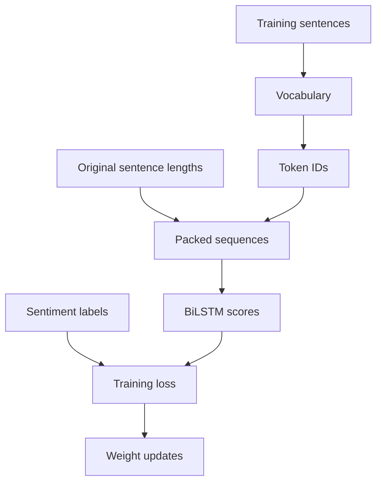
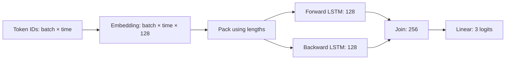
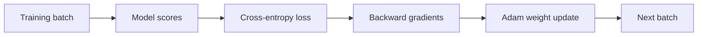
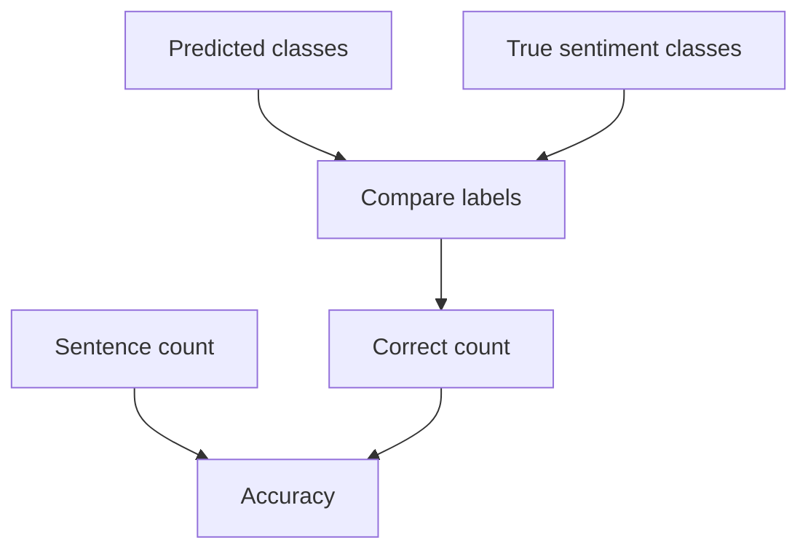
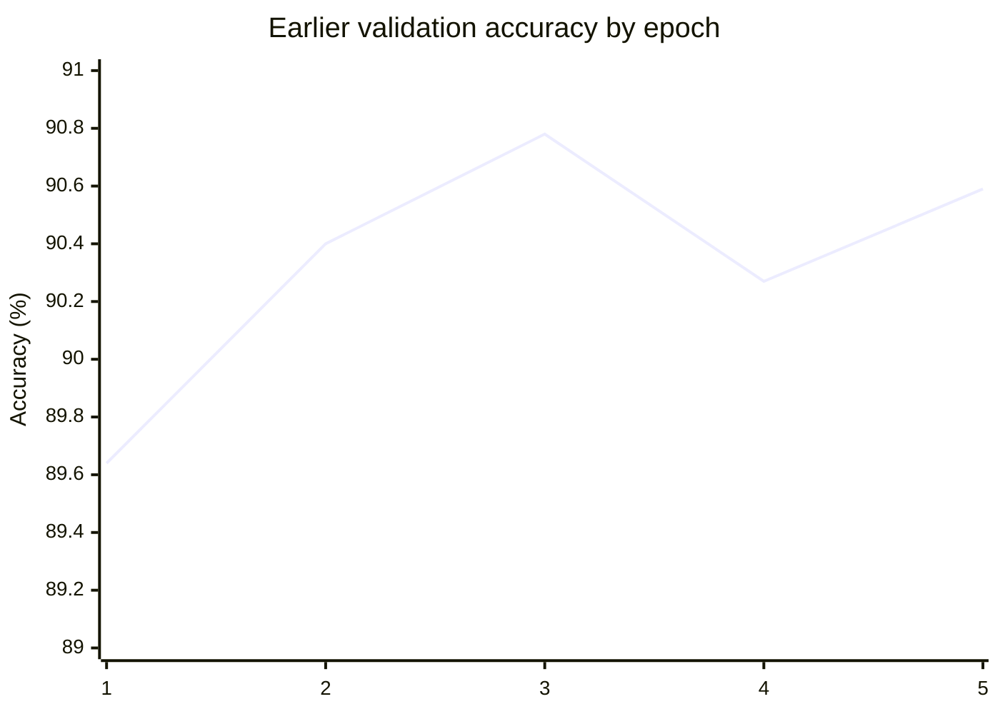

# BiLSTM sentiment model: structure and training report

## Purpose and scope

This project classifies the sentiment of Vietnamese student feedback. It uses the supplied training, validation, and test splits of the UIT Vietnamese Students' Feedback Corpus. Each row contains a sentence, a sentiment label, and a topic label. The current model predicts **sentiment only**. The batch builder returns the topic label, but the model and loss do not use it.

The program has three source files:

| File | Responsibility |
| --- | --- |
| `train.py` | Tokenize text, build the vocabulary, encode sentences, and build batches. |
| `BiLSTM.py` | Define the embedding, bidirectional LSTM, and sentiment output layer. |
| `main.py` | Load data, create data loaders, train, select the best epoch, and evaluate. |

The name `train.py` is historical. Its current functions prepare data; `train_one_epoch()` is in `main.py`.

## Overall structure

The structure diagram shows the order in which data passes through the program. The following relationship graph shows which data controls each operation.

The vocabulary uses training sentences only. Validation and test sentences use that same vocabulary. An unseen token receives the `<unk>` ID.

## 1. Data preparation in `train.py`

### `tokenize(sentence)`

1. Convert the sentence to lowercase with `sentence.lower()`.
2. Pass the result to `underthesea.word_tokenize()`.
3. Return the resulting tokens.

The same function is used during vocabulary construction and sentence encoding. This keeps the token-to-ID mapping consistent.

### `build_vocab(sentences, min_freq=1)`

1. Create a `Counter` for token frequencies.
2. Reserve ID `0` for `<pad>` and ID `1` for `<unk>`.
3. Tokenize each training sentence and add its tokens to the counter.
4. Sort the tokens. Add each token whose frequency meets `min_freq`.
5. Return a dictionary from token text to integer ID.

`main()` calls this function with `ds["train"]["sentence"]`. The reported vocabulary size was 4,011 in an earlier run. The size can change if the data or tokenization changes.

`<pad>` fills unused positions in a batch. `<unk>` represents a token absent from the training vocabulary.

### `encode_sentence(sentence, vocab)`

1. Tokenize the sentence with `tokenize()`.
2. Look up each token in `vocab`.
3. Use the `<unk>` ID when the token is absent.
4. If tokenization produced no tokens, return one `<unk>` ID. The LSTM requires a sequence length greater than zero.
5. Return the ordered list of IDs.

The function does not truncate sentences. All tokens in a sentence remain in its encoded sequence.

### `collate_batch(rows, vocab)`

`DataLoader` calls this function for each batch of dataset rows:

1. Encode each row's `sentence` as a `torch.long` tensor.
2. Record the unpadded length of each encoded sentence.
3. Use `pad_sequence(..., batch_first=True)` to give all sequences the same width.
4. Use ID `0`, the `<pad>` ID, for padding.
5. Convert sentiment and topic labels to tensors.
6. Return `(token_ids, lengths, sentiments, topics)`.

For example, a previous batch had `token_ids.shape == (32, 24)`. It contained 32 sentences. The longest encoded sentence in that batch used 24 positions. Other batches can have a different width.

If a sentence has no tokens, `encode_sentence()` supplies one `<unk>` ID. This gives `pack_padded_sequence()` a valid positive length. It does not add information to an empty sentence.

## 2. Model structure in `BiLSTM.py`

### `BiLSTM.__init__(vocab_size, embedding_dim=128, hidden_dim=128)`

The constructor creates three layers:

1. `nn.Embedding(vocab_size, embedding_dim, padding_idx=0)` maps each token ID to a trainable 128-value vector. The padding row uses ID `0`.
2. `nn.LSTM(embedding_dim, hidden_dim, batch_first=True, bidirectional=True)` reads each sequence in two directions. Each direction has a 128-value hidden state.
3. `nn.Linear(hidden_dim * 2, 3)` maps the joined 256-value state to three sentiment scores.

The output width `3` assumes that the sentiment labels are the integer classes `0`, `1`, and `2`. These scores are *logits*. They are not probabilities.

### `BiLSTM.forward(token_ids, lengths)`

1. `self.embedding(token_ids)` changes the ID tensor from shape `[batch, time]` to `[batch, time, embedding_dim]`.
2. `pack_padded_sequence(..., lengths.cpu(), batch_first=True, enforce_sorted=False)` uses the original lengths. This prevents padded positions from acting as sentence content. The lengths are passed on the CPU, and batches do not need length sorting.
3. `self.lstm(packed)` computes hidden states in both directions. The code keeps the final hidden states and does not use the output for each token.
4. `torch.cat((hidden[0], hidden[1]), dim=1)` joins the final state from the forward direction with the final state from the backward direction.
5. `self.sentiment_head(sentence_state)` returns a tensor with shape `[batch, 3]`.

The current LSTM has one layer. For this setting, `hidden[0]` and `hidden[1]` are its two directions. If more LSTM layers are added, the code must use the two states from the final layer instead.

## 3. Data and model setup in `main.py`

At module import, `device` is set to `"cuda"` when CUDA is available. Otherwise, it is `"cpu"`. `main()` loads the three parquet files named in `data_files`. Network access or a populated local dataset cache is needed for this load.

`main()` performs these steps:

1. Load all rows from each supplied split. Print each split's row count.
2. Reject an empty split or sentiment labels outside `{0, 1, 2}` before training starts.
3. Build the vocabulary from the full training split.
4. Create `train_loader` with batch size 32 and `shuffle=True`.
5. Create `validation_loader` and `test_loader` with batch size 32 and `shuffle=False`.
6. Pass `collate_batch(rows, vocab)` to each loader so all splits use the same vocabulary.
7. Create `BiLSTM(len(vocab))` and move it to the selected device.
8. Create `CrossEntropyLoss` for the three-class sentiment task.
9. Create an Adam optimizer with learning rate `0.001`.
10. Train for five epochs. Validate after each epoch.
11. Keep an independent copy of the weights from the epoch with the highest validation accuracy.
12. Restore those weights and measure test accuracy once.

The training loader uses every row in the training split during each epoch. It does not combine validation or test rows with training rows. The test split does not choose the best epoch. Validation accuracy makes that choice. A run can produce different scores because the model starts with random weights and the training loader shuffles rows.

## 4. One training epoch: `train_one_epoch()`

`train_one_epoch(model, loader, loss_fn, optimizer, device)` visits every batch in the training loader once:

1. Call `model.train()`. This selects training behavior for model layers.
2. Set `total_loss` to zero.
3. For each batch, unpack token IDs, lengths, and sentiment labels. The topic label is ignored.
4. Move token IDs and sentiment labels to the model's device. `forward()` moves lengths to the CPU for sequence packing.
5. Call `optimizer.zero_grad()` to clear gradients from the previous batch.
6. Call `model(token_ids, lengths)`. PyTorch calls `forward()` and returns three logits per sentence.
7. Call `loss_fn(scores, sentiments)`. `CrossEntropyLoss` compares logits with integer class labels. Do not apply softmax before this loss.
8. Call `loss.backward()` to calculate a gradient for each trainable parameter.
9. Call `optimizer.step()` to update those parameters.
10. Add `loss.item()` to `total_loss`.
11. Return `total_loss / len(loader)` after all batches.

The returned number is the mean of batch losses. It is not weighted by batch size, so a smaller final batch has the same weight as other batches in this reported mean. This does not change how each batch trains the model.

## 5. Validation and test measurement: `validate()`

`validate(model, loader, device)` measures classification accuracy without changing model weights:

1. Call `model.eval()` to select evaluation behavior.
2. Set correct and total counters to zero.
3. Enter `torch.no_grad()` to avoid gradient calculations.
4. Run each batch through the model.
5. Use `scores.argmax(dim=1)` to choose the class with the highest logit.
6. Compare predictions with sentiment labels and count correct results.
7. Divide correct predictions by the number of sentences.

The function serves both validation and test loaders. Its result is accuracy, not macro F1 or loss. It assumes that the loader contains at least one sentence.

## 6. Best epoch selection and final test

The loop begins with `best_accuracy = -1.0`. Every valid accuracy is at least zero, so the first epoch supplies initial best weights. After each epoch, validation accuracy is compared with the best value. If it improves, `deepcopy(model.state_dict())` stores an independent copy of the current weights. An ordinary reference would change when later training updates the model.

After five epochs, `model.load_state_dict(best_weights)` restores the best validation epoch. The same `validate()` function then measures test accuracy. The program prints that result. It does not yet write the model weights or vocabulary to disk.

The earlier five-epoch run, before best-weight selection was added, produced these values:

| Epoch | Training loss | Validation accuracy |
| ---: | ---: | ---: |
| 1 | 0.3882 | 89.64% |
| 2 | 0.2374 | 90.40% |
| 3 | 0.1673 | 90.78% |
| 4 | 0.1092 | 90.27% |
| 5 | 0.0554 | 90.59% |

Epoch 3 had the highest validation accuracy in that run. The code now selects the best epoch automatically. A new run can select a different epoch. Training loss fell through epoch 5, while validation accuracy varied after epoch 3. This pattern can indicate overfitting, but these five results alone do not prove it.

## Run status and next actions

The current code has **not** been run for training as part of this report update. Running `python main.py` starts data loading and then model training. The program first prints the three split sizes, then five epoch lines and one final test accuracy line. This environment blocks the dataset download, so the actual split sizes and labels were not verified here. The checks in `main()` will verify them before training begins in an environment with access to the files.

The present result covers sentiment accuracy only. If the goal later includes topic prediction, add a topic output layer, include topic loss during training, and report topic metrics separately. If the goal requires repeatable comparisons, set random seeds and record the dataset and package versions. If the goal requires inference after the process exits, save both the selected model weights and the vocabulary.

Dataset: [UIT Vietnamese Students' Feedback Corpus](https://huggingface.co/datasets/uitnlp/vietnamese_students_feedback).
